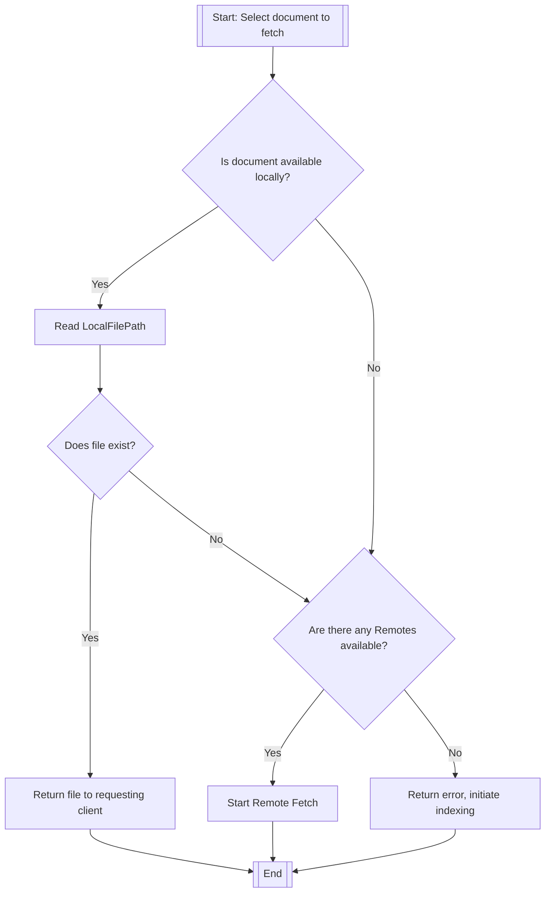
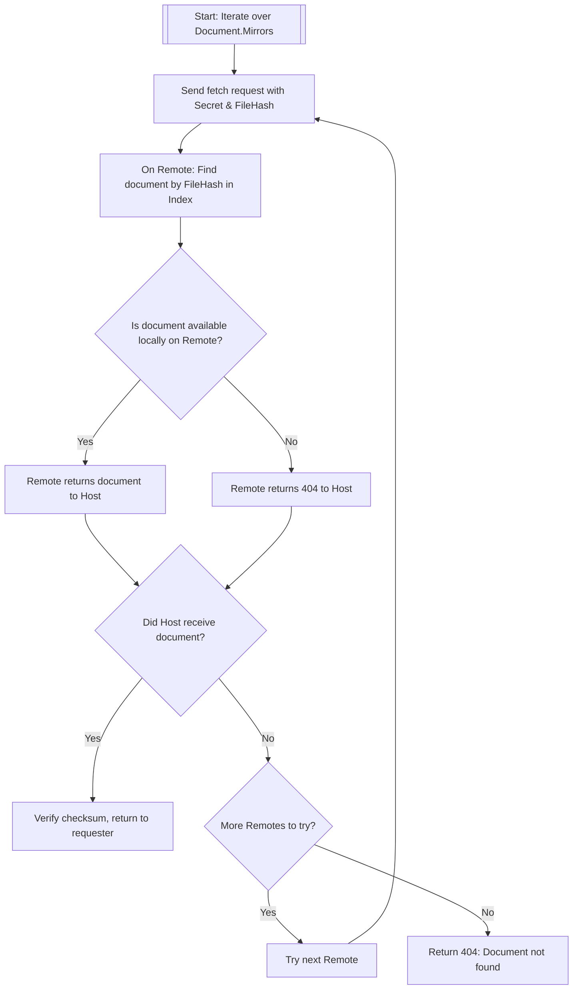
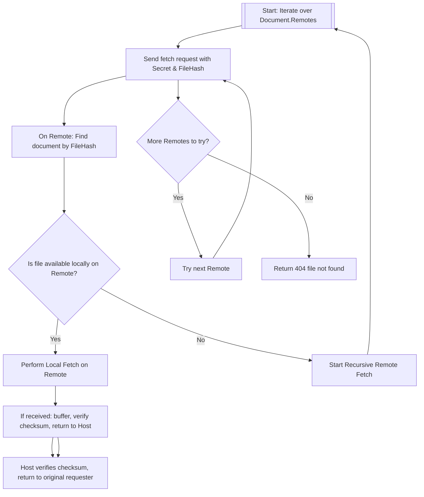

# Download Algorithm

## Local Fetch – `LocalFetch`

---

## Remote Fetch – PeerOnly Network

## Remote Fetch – Public Network

---

## Notes

* **TTL (Time To Live)**/**Hops** should be part of the download request. If it goes over the limit, return 404.
* If **Remote is inaccessible** (timeout), skip it and try another. Return `404` only when all available remotes are used up.
