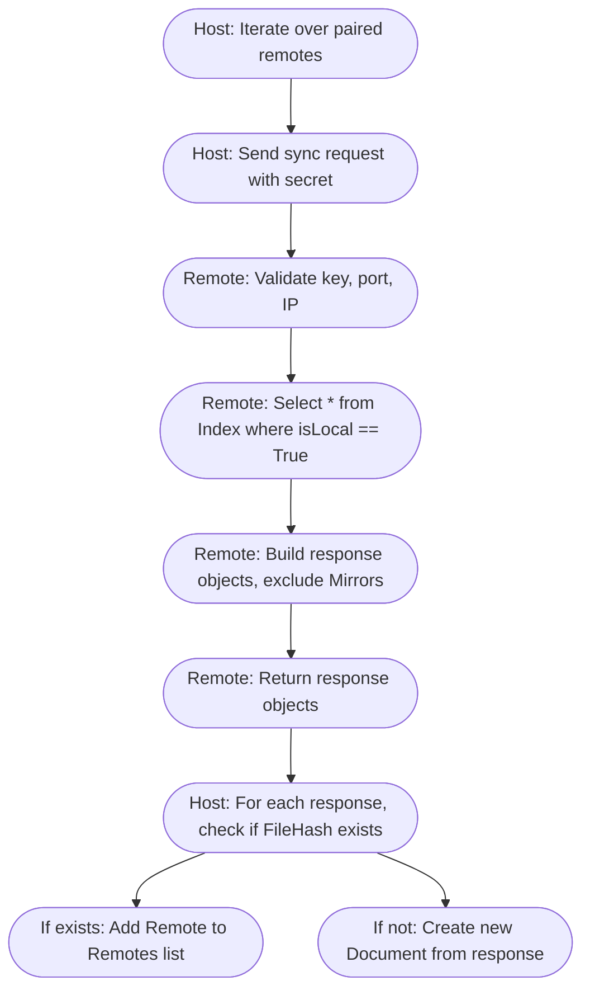

# Synchronization of local indexes between hosts

```mermaid
flowchart TD
    H1([Host: Iterate over paired remotes])
    H2([Host: Send sync request with secret])
    R1([Remote: Validate key, port, IP])
    R2([Remote: Select * from Index where isLocal == True])
    R3([Remote: Build response objects, exclude Mirrors])
    R4([Remote: Return response objects])
    H3([Host: For each response, check if FileHash exists])
    H4A([If exists: Add Remote to Remotes list])
    H4B([If not: Create new Document from response])

    H1 --> H2 --> R1 --> R2 --> R3 --> R4 --> H3
    H3 --> H4A
    H3 --> H4B
```